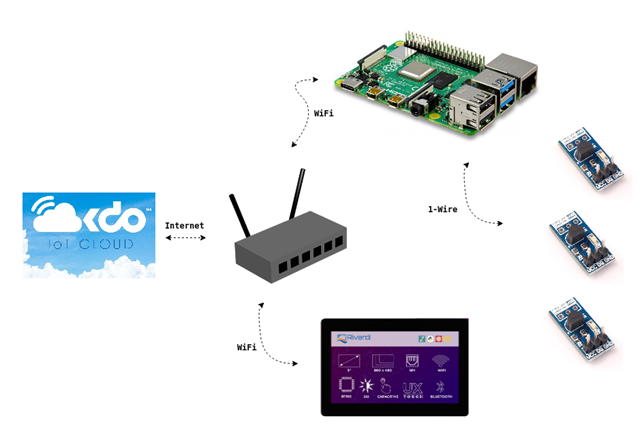

# Remote TCP-IP Display for Raspberry Pi

**Monitor temperature on the Raspberry Pi and visualize the results on a remote TCP-IP display and in an OKdo Cloud Dashboard.**

---



---

* /project/raspberry_pi/ - Nodejs code for Raspberry Pi code 
* /project/zerynth/ - Zerynth code for Riverdi IOT Display with ESP

---

## Raspberry Pi setup

```bash
$ sudo apt-get install nodejs npm 
$ npm install allthingstalk systeminformation 
```


